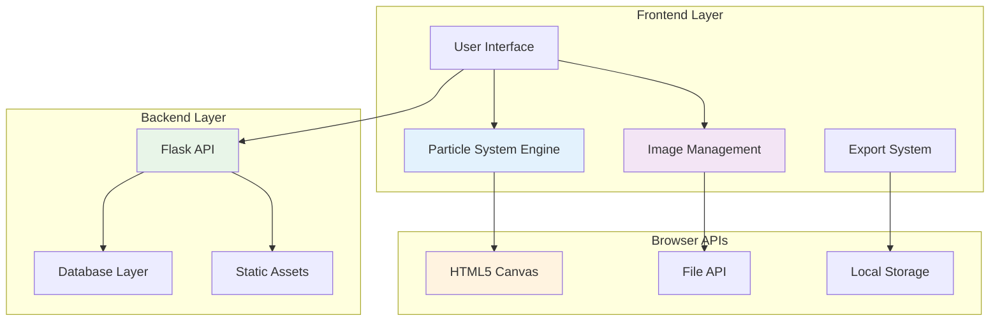
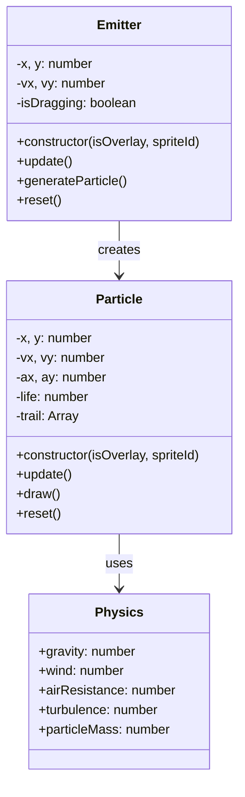
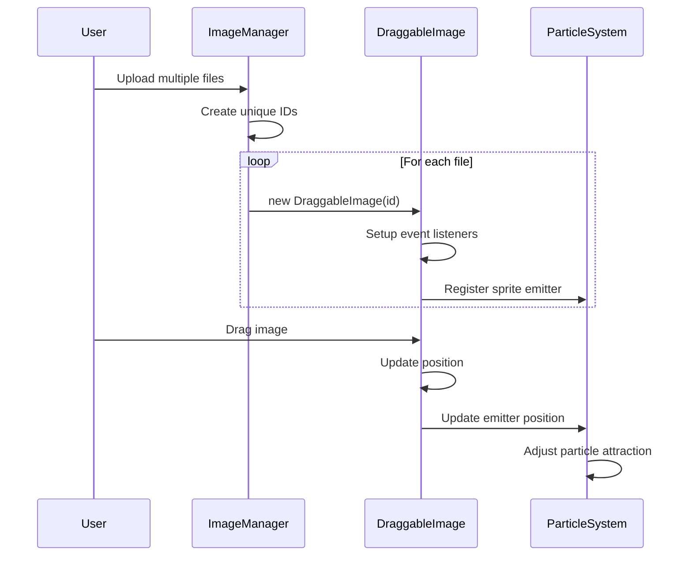
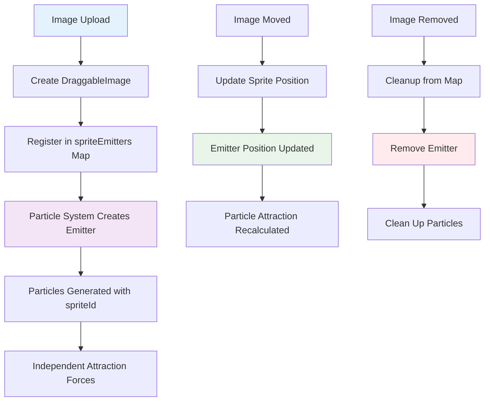
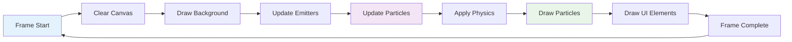
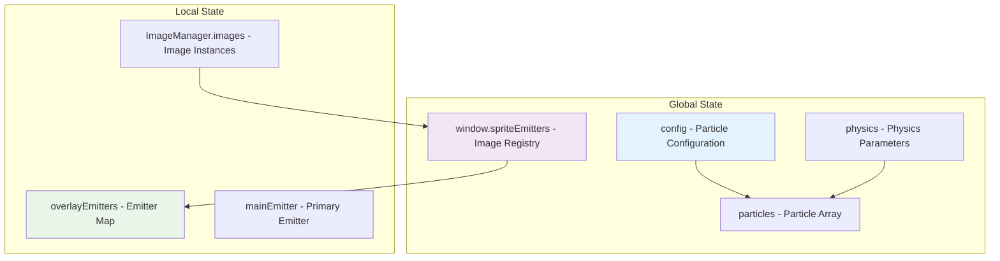
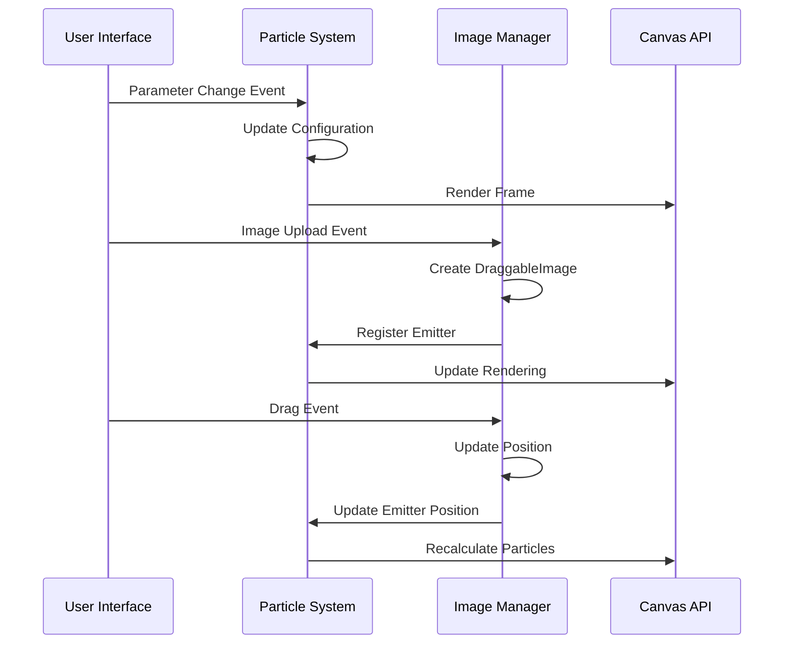
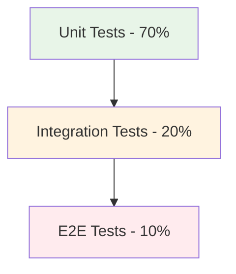

# SparkleGeneratorFX™ Architecture Documentation

This document provides an in-depth technical overview of the SparkleGeneratorFX™ architecture, system design decisions, and implementation details.

## 🏗 System Overview

SparkleGeneratorFX™ follows a modular, event-driven architecture that separates particle physics simulation, user interface management, and data persistence into distinct layers.

### High-Level Architecture



## 🔧 Core Components

### Particle System Engine (`particle-system.js`)

The heart of the application, responsible for physics simulation and rendering.

#### Class Hierarchy



#### Particle Physics Implementation

```javascript
// Verlet integration for smooth particle movement
update() {
    // Apply forces
    this.ax = physics.wind;
    this.ay = physics.gravity;
    
    // Air resistance (quadratic drag)
    const speed = Math.sqrt(this.vx * this.vx + this.vy * this.vy);
    if (speed > 0) {
        this.ax -= (this.vx / speed) * physics.airResistance * speed * speed;
        this.ay -= (this.vy / speed) * physics.airResistance * speed * speed;
    }
    
    // Perlin noise-based turbulence
    const time = Date.now() * 0.001;
    this.ax += Math.sin(time * 2 + this.x * 0.1) * physics.turbulence;
    this.ay += Math.cos(time * 2 + this.y * 0.1) * physics.turbulence;
    
    // Attraction to emitters
    if (this.isOverlay && this.spriteId) {
        this.applyAttractionForce();
    }
    
    // Numerical integration
    this.vx += this.ax;
    this.vy += this.ay;
    this.x += this.vx;
    this.y += this.vy;
    
    // Apply friction
    this.vx *= physics.friction;
    this.vy *= physics.friction;
}
```

### Multi-Image Management (`draggable-image.js`)

Handles multiple draggable images with independent particle emission.

#### Data Flow



#### Image Management Architecture

```javascript
// Global sprite emitter registry
window.spriteEmitters = new Map();

// Individual image management
class DraggableImage {
    updateSpritePosition() {
        const rect = this.imageContainer.getBoundingClientRect();
        
        // Register in global collection
        window.spriteEmitters.set(this.id, {
            id: this.id,
            x: rect.left + rect.width / 2,
            y: rect.top + rect.height / 2,
            width: rect.width,
            height: rect.height
        });
        
        // Maintain backward compatibility
        if (window.spriteEmitters.size === 1) {
            window.spriteEmitter = window.spriteEmitters.get(this.id);
        }
    }
}
```

### Emitter Management System

The system creates and manages individual emitters for each uploaded image:



## 🎨 Rendering Pipeline

### Canvas Rendering Flow



### Performance Optimizations

1. **Object Pooling**: Reuse particle objects to reduce garbage collection
2. **Batch Operations**: Group similar rendering operations
3. **Efficient Collision Detection**: Spatial partitioning for large particle counts
4. **Viewport Culling**: Only render visible particles

```javascript
// Efficient particle update loop
particles.forEach(particle => {
    // Skip dead particles
    if (particle.life <= 0) return;
    
    // Update physics
    particle.update();
    
    // Viewport culling
    if (particle.x < -50 || particle.x > width + 50 ||
        particle.y < -50 || particle.y > height + 50) {
        particle.life = 0; // Mark for removal
        return;
    }
    
    // Render
    particle.draw();
});
```

## 💾 Data Management

### State Management Architecture



### Data Persistence

1. **Client-Side**: Local Storage for user preferences
2. **Server-Side**: PostgreSQL for community presets
3. **Export Formats**: JSON, XML, CSV, JavaScript

```javascript
// Preset data structure
const presetData = {
    config: {
        count: 50,
        size: 5,
        speed: 5,
        color: "#ffffff",
        shape: "circle"
    },
    physics: {
        gravity: 0.1,
        wind: 0,
        airResistance: 0.02,
        turbulence: 0.1
    },
    metadata: {
        name: "Sparkle Effect",
        description: "Beautiful sparkle particles",
        created: new Date().toISOString(),
        version: "1.0"
    }
};
```

## 🔄 Event System

### Event-Driven Architecture



### Event Handling Patterns

```javascript
// Centralized event handling
class EventManager {
    constructor() {
        this.listeners = new Map();
    }
    
    on(event, callback) {
        if (!this.listeners.has(event)) {
            this.listeners.set(event, []);
        }
        this.listeners.get(event).push(callback);
    }
    
    emit(event, data) {
        if (this.listeners.has(event)) {
            this.listeners.get(event).forEach(callback => callback(data));
        }
    }
}
```

## 🚀 Performance Considerations

### Bottleneck Analysis

1. **Particle Update Loop**: O(n) complexity where n = particle count
2. **Canvas Rendering**: GPU-bound operations
3. **Physics Calculations**: CPU-intensive mathematical operations
4. **Image Processing**: Memory and CPU intensive

### Optimization Strategies

```javascript
// Spatial partitioning for collision detection
class SpatialGrid {
    constructor(width, height, cellSize) {
        this.cellSize = cellSize;
        this.cols = Math.ceil(width / cellSize);
        this.rows = Math.ceil(height / cellSize);
        this.grid = new Array(this.cols * this.rows);
    }
    
    insert(particle) {
        const col = Math.floor(particle.x / this.cellSize);
        const row = Math.floor(particle.y / this.cellSize);
        const index = row * this.cols + col;
        
        if (!this.grid[index]) this.grid[index] = [];
        this.grid[index].push(particle);
    }
}
```

### Memory Management

1. **Particle Pooling**: Reuse objects to reduce GC pressure
2. **Texture Atlas**: Combine small images into larger textures
3. **Event Listener Cleanup**: Remove listeners on component destruction
4. **WeakMap Usage**: For temporary object associations

## 🔒 Security Considerations

### Input Validation

```javascript
// Image upload validation
function validateImageFile(file) {
    // Check file type
    const allowedTypes = ['image/jpeg', 'image/png', 'image/gif'];
    if (!allowedTypes.includes(file.type)) {
        throw new Error('Invalid file type');
    }
    
    // Check file size (max 5MB)
    if (file.size > 5 * 1024 * 1024) {
        throw new Error('File too large');
    }
    
    return true;
}
```

### Content Security Policy

```html
<meta http-equiv="Content-Security-Policy" 
      content="default-src 'self'; 
               script-src 'self' 'unsafe-inline' https://unpkg.com; 
               style-src 'self' 'unsafe-inline'; 
               img-src 'self' data: blob:;">
```

## 📈 Scalability Patterns

### Horizontal Scaling

1. **CDN Integration**: Static asset distribution
2. **Load Balancing**: Multiple Flask instances
3. **Database Sharding**: Partition preset data
4. **Caching Strategy**: Redis for session data

### Vertical Scaling

1. **WebGL Rendering**: GPU acceleration for particles
2. **Web Workers**: Offload physics calculations
3. **OffscreenCanvas**: Background rendering
4. **WebAssembly**: High-performance physics engine

```javascript
// Web Worker for physics calculations
// physics-worker.js
self.onmessage = function(e) {
    const { particles, physics, deltaTime } = e.data;
    
    // Perform physics calculations
    particles.forEach(particle => {
        particle.vx += particle.ax * deltaTime;
        particle.vy += particle.ay * deltaTime;
        particle.x += particle.vx * deltaTime;
        particle.y += particle.vy * deltaTime;
    });
    
    self.postMessage({ particles });
};
```

## 🧪 Testing Architecture

### Test Pyramid



### Testing Strategies

1. **Unit Tests**: Individual function validation
2. **Integration Tests**: Component interaction testing
3. **Performance Tests**: Frame rate and memory benchmarks
4. **Visual Regression Tests**: Screenshot comparison
5. **Cross-Browser Tests**: Compatibility validation

## 📊 Monitoring and Analytics

### Performance Metrics

```javascript
// Performance monitoring
class PerformanceMonitor {
    constructor() {
        this.metrics = {
            fps: 0,
            particleCount: 0,
            memoryUsage: 0,
            renderTime: 0
        };
    }
    
    measure() {
        this.metrics.fps = this.calculateFPS();
        this.metrics.memoryUsage = performance.memory?.usedJSHeapSize || 0;
        this.metrics.renderTime = this.measureRenderTime();
    }
}
```

### Error Tracking

```javascript
// Global error handler
window.addEventListener('error', (event) => {
    console.error('JavaScript Error:', {
        message: event.message,
        filename: event.filename,
        line: event.lineno,
        column: event.colno,
        stack: event.error?.stack
    });
});
```

---

This architecture documentation provides the foundation for understanding and extending SparkleGeneratorFX™. The modular design ensures maintainability while the performance optimizations enable smooth real-time particle simulation.