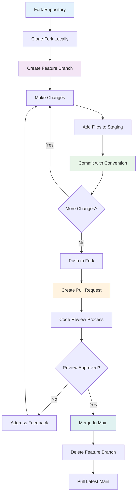

# Contributing to SparkleGeneratorFX™

Thank you for your interest in contributing to SparkleGeneratorFX™! This document provides guidelines and workflows for contributing to the project.

## 🚀 Quick Start for Contributors

### Prerequisites
- Git installed and configured
- Python 3.8+ 
- Node.js (for frontend development tools)
- Modern web browser for testing

### Development Setup

1. **Fork and Clone**
```bash
git clone https://github.com/yourusername/SparkleGeneratorFX.git
cd SparkleGeneratorFX
```

2. **Create Development Branch**
```bash
git checkout -b feature/your-feature-name
```

3. **Install Dependencies**
```bash
pip install -r requirements.txt
```

4. **Run Development Server**
```bash
python main.py
```

## 📋 Development Workflow

### Git Workflow and Commit Standards

We follow a structured Git workflow to maintain code quality and project history:

#### Branch Naming Convention
- `feature/description` - New features
- `fix/description` - Bug fixes
- `docs/description` - Documentation updates
- `refactor/description` - Code refactoring
- `perf/description` - Performance improvements

#### Commit Message Format
Follow conventional commit format:

```
<type>(<scope>): <description>

[optional body]

[optional footer(s)]
```

**Types:**
- `feat`: New feature
- `fix`: Bug fix
- `docs`: Documentation only changes
- `style`: Changes that don't affect meaning (formatting, etc.)
- `refactor`: Code change that neither fixes a bug nor adds a feature
- `perf`: Performance improvement
- `test`: Adding missing tests
- `chore`: Changes to build process or auxiliary tools

**Examples:**
```bash
feat(particle-system): add multiple sprite emitter support
fix(draggable-image): resolve positioning offset calculation
docs(readme): update installation instructions
perf(rendering): optimize particle update loop
refactor(emitters): extract emitter management to separate class
```

### Detailed Git Workflow Diagram



### Code Review Process

1. **Self Review Checklist**
   - [ ] Code follows project style guidelines
   - [ ] All tests pass locally
   - [ ] Performance impact assessed
   - [ ] Documentation updated if needed
   - [ ] No console errors or warnings

2. **Pull Request Requirements**
   - Clear description of changes
   - Reference to related issues
   - Screenshots/videos for UI changes
   - Performance benchmark results (if applicable)

3. **Review Criteria**
   - Code quality and readability
   - Performance implications
   - Browser compatibility
   - Mobile responsiveness
   - Security considerations

## 🛠 Technical Guidelines

### JavaScript Code Style

```javascript
// Use ES6+ features
const config = {
  count: 50,
  size: 5,
  speed: 5
};

// Descriptive variable names
const particleEmitterManager = new EmitterManager();

// Comment complex algorithms
// Apply Verlet integration for particle physics
particle.x += particle.vx * deltaTime + 0.5 * particle.ax * deltaTime * deltaTime;
```

### Python Code Style
Follow PEP 8 with these additions:

```python
# Type hints for function parameters
def create_preset(name: str, config: dict) -> ParticlePreset:
    """Create a new particle preset with validation."""
    pass

# Descriptive class and method names
class ParticlePresetManager:
    def validate_configuration(self, config: dict) -> bool:
        """Validate particle configuration parameters."""
        pass
```

### Performance Guidelines

1. **Particle System Optimization**
   - Target 60fps at 1080p resolution
   - Efficient collision detection algorithms
   - Object pooling for particles
   - Minimize canvas redraw operations

2. **Memory Management**
   - Clean up event listeners on component destruction
   - Remove unused particle emitters
   - Optimize image loading and storage

3. **Browser Compatibility**
   - Test in Chrome, Firefox, Safari, and Edge
   - Progressive enhancement for mobile devices
   - Graceful degradation for older browsers

## 🧪 Testing Guidelines

### Manual Testing Checklist

**Core Functionality:**
- [ ] Single image upload and particle emission
- [ ] Multiple image upload (2-5 images)
- [ ] Image dragging and positioning
- [ ] Image resizing with handles
- [ ] Image removal and cleanup
- [ ] Physics parameter adjustment
- [ ] Preset saving and loading
- [ ] Export functionality

**Performance Testing:**
- [ ] 60fps with 100+ particles
- [ ] Memory usage under 100MB
- [ ] Smooth interaction with 5+ images
- [ ] No memory leaks after extended use

**Cross-Browser Testing:**
- [ ] Chrome (latest)
- [ ] Firefox (latest)
- [ ] Safari (latest)
- [ ] Edge (latest)
- [ ] Mobile browsers (iOS Safari, Chrome Mobile)

### Automated Testing

```bash
# Run performance benchmarks
npm run test:performance

# Check code quality
npm run lint

# Validate browser compatibility
npm run test:browsers
```

## 📊 Performance Benchmarks

### Target Metrics
- **Frame Rate**: 60fps minimum at 1920x1080
- **Particle Count**: 500+ particles without degradation
- **Memory Usage**: < 100MB for typical usage
- **Load Time**: < 3 seconds on 3G connection
- **Image Support**: 10+ simultaneous sprite emitters

### Profiling Tools
- Chrome DevTools Performance tab
- Firefox Developer Tools Performance
- Custom performance monitoring in application

## 🔧 Architecture Decisions

### When Adding New Features

1. **Assess Impact**
   - Performance implications
   - Browser compatibility
   - Mobile device support
   - Memory usage impact

2. **Design Patterns**
   - Maintain separation of concerns
   - Use event-driven architecture
   - Follow existing class structure
   - Document public APIs

3. **Integration Points**
   - Particle system compatibility
   - Image management integration
   - Export system support
   - Preset configuration inclusion

## 📝 Documentation Standards

### Code Documentation
```javascript
/**
 * Manages multiple particle emitters for sprite-based emission
 * @class EmitterManager
 */
class EmitterManager {
  /**
   * Creates a new emitter for the specified sprite
   * @param {string} spriteId - Unique identifier for the sprite
   * @param {Object} position - Initial position {x, y}
   * @returns {Emitter} New emitter instance
   */
  createEmitter(spriteId, position) {
    // Implementation
  }
}
```

### README Updates
- Keep installation instructions current
- Update feature lists with new capabilities
- Include performance benchmarks
- Add troubleshooting sections

### API Documentation
- Document all public methods
- Include parameter types and descriptions
- Provide usage examples
- Note browser compatibility requirements

## 🚨 Issue Reporting

### Bug Reports
Include the following information:
- Browser and version
- Operating system
- Steps to reproduce
- Expected vs actual behavior
- Console error messages
- Screenshots or video recordings

### Feature Requests
- Clear description of the feature
- Use cases and benefits
- Potential implementation approach
- Performance considerations

## 🎯 Getting Help

- **Questions**: Open a [Discussion](https://github.com/yourusername/SparkleGeneratorFX/discussions)
- **Bugs**: Create an [Issue](https://github.com/yourusername/SparkleGeneratorFX/issues)
- **Contributions**: Submit a [Pull Request](https://github.com/yourusername/SparkleGeneratorFX/pulls)

## 📜 License

By contributing to SparkleGeneratorFX™, you agree that your contributions will be licensed under the MIT License.

---

**Thank you for contributing to SparkleGeneratorFX™!** 🌟