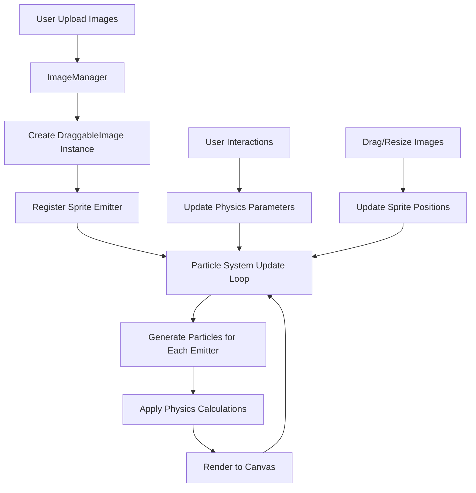
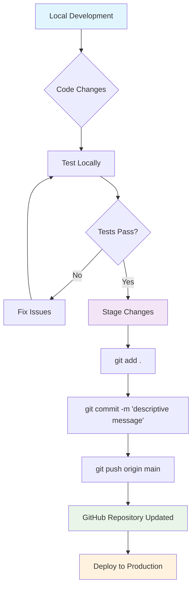

# SparkleGeneratorFX™

> **Advanced Web-Based Particle Physics Simulation Platform**

SparkleGeneratorFX™ is a sophisticated, real-time particle physics simulation engine that enables users to create dynamic particle interactions through an innovative web interface. The system supports sprite-based particle emission, multiple draggable image overlays, and advanced particle physics with real-time manipulation.


## 🌟 Key Features

- **Real-time Particle Physics**: Advanced particle simulation with customizable physics parameters
- **Sprite-Based Emission**: Upload images that act as particle emitters with independent positioning
- **Multiple Image Support**: Drag, resize, and position multiple images simultaneously
- **Interactive Controls**: Real-time adjustment of particle count, speed, color, and physics
- **Advanced Shapes**: Support for circles, squares, triangles, stars, and polygons
- **Export Capabilities**: Save configurations and export animations
- **Responsive Design**: Optimized for various screen sizes and devices

## 🛠 Technology Stack

### Frontend
- **Kaboom.js** - Advanced 2D graphics rendering and game engine
- **HTML5 Canvas** - High-performance particle visualization
- **Vanilla JavaScript** - Pure JS for optimal performance
- **CSS3** - Modern styling and responsive design

### Backend
- **Flask** - Python web framework for API endpoints
- **SQLAlchemy** - Database ORM for preset management
- **PostgreSQL** - Production database for storing user configurations

### Architecture
- **Component-Based Design** - Modular JavaScript architecture
- **Event-Driven System** - Reactive particle and emitter management
- **Real-time Rendering** - 60fps particle simulation

## 📁 Project Structure

```
SparkleGeneratorFX/
├── static/
│   ├── css/
│   │   └── style.css                 # Main styling and responsive design
│   ├── js/
│   │   ├── particle-system.js        # Core particle physics engine
│   │   ├── draggable-image.js        # Multi-image management system
│   │   ├── controls.js               # UI control handlers
│   │   ├── export.js                 # Export and save functionality
│   │   ├── preset-sharing.js         # Preset management system
│   │   ├── tutorial.js               # Interactive tutorial system
│   │   ├── vector-path.js            # Vector path drawing tools
│   │   └── video-export.js           # Animation export functionality
│   └── images/                       # Static image assets
├── templates/
│   └── index.html                    # Main application template
├── app.py                            # Flask application and API routes
├── main.py                           # Application entry point
└── README.md                         # This documentation
```

## 🔧 How It Works

### Core Architecture

SparkleGeneratorFX™ operates on a multi-layered architecture that separates concerns between particle physics, image management, and user interface:

#### 1. Particle Physics Engine (`particle-system.js`)
The core of the system is built around several key classes:

```javascript
// Main particle class with physics simulation
class Particle {
    constructor(isOverlay = false, spriteId = null)
    update()     // Physics calculations and movement
    draw()       // Rendering to canvas
    reset()      // Reinitialize particle properties
}

// Particle emitter management
class Emitter {
    constructor(isOverlay = false, spriteId = null)
    update()           // Position tracking and velocity calculation
    generateParticle() // Create new particles with physics properties
}
```

#### 2. Multi-Image Management (`draggable-image.js`)
The image system supports unlimited draggable sprites:

```javascript
// Image collection manager
class ImageManager {
    handleImageUpload()  // Process multiple file uploads
    removeImage()        // Clean removal with particle system integration
}

// Individual draggable image with particle emission
class DraggableImage {
    setupEventListeners()   // Mouse/touch interaction
    updateSpritePosition()  // Sync with particle emitters
    addResizeHandles()      // Dynamic resizing capabilities
}
```

#### 3. Physics System
Advanced particle physics with real-time parameters:

- **Gravity**: Downward acceleration force
- **Wind**: Horizontal environmental force  
- **Air Resistance**: Velocity-dependent drag
- **Turbulence**: Perlin noise-based random forces
- **Attraction**: Magnetic-like forces to emitter sources
- **Collision**: Inter-particle interaction (optional)

### Particle Emission System

#### Main Emitter
- **Position**: Center of canvas or user-dragged location
- **Behavior**: Continuous particle generation with cursor tracking
- **Physics**: Standard attraction and physics application

#### Sprite Emitters (Multiple)
- **Position**: Independent positioning based on uploaded image locations
- **Behavior**: Sprite-based emission within image boundaries
- **Physics**: Independent attraction to their respective image positions
- **Scaling**: Emission area scales with image resize operations

### Data Flow Architecture



## 🚀 Getting Started

### Prerequisites
- Python 3.8+
- Modern web browser with HTML5 Canvas support
- Optional: PostgreSQL for preset storage

### Installation

1. **Clone the repository**
```bash
git clone https://github.com/yourusername/SparkleGeneratorFX.git
cd SparkleGeneratorFX
```

2. **Install Python dependencies**
```bash
pip install flask flask-sqlalchemy psycopg2-binary sqlalchemy trafilatura email-validator
```

3. **Run the application**
```bash
python main.py
```

4. **Open your browser**
Navigate to `http://localhost:5000`

### Quick Start Guide

1. **Upload Images**: Click "Upload Overlay Images" to add sprite emitters
2. **Adjust Physics**: Use the control panel to modify particle behavior
3. **Interact**: Drag images around, resize them, or click on the canvas
4. **Experiment**: Try different shapes, colors, and physics settings
5. **Save**: Export your configuration or save as a preset

## 🎮 Usage Examples

### Basic Particle System
```javascript
// Initialize particle system with default settings
const config = {
    count: 50,
    size: 5,
    speed: 5,
    color: "#ffffff",
    shape: 'circle'
};
```

### Adding Custom Sprite Emitters
```javascript
// Upload and position multiple images
const imageManager = new ImageManager();
// Images automatically become particle emitters when uploaded
```

### Physics Customization
```javascript
// Modify physics parameters
const physics = {
    gravity: 0.1,
    wind: 0,
    airResistance: 0.02,
    turbulence: 0.1,
    particleMass: 0.59
};
```

## 🔄 Development Workflow

### Git Commit Workflow



### Recommended Commit Structure

```bash
# Feature additions
git commit -m "feat: add multiple image drag support"

# Bug fixes  
git commit -m "fix: resolve particle positioning error"

# Performance improvements
git commit -m "perf: optimize particle rendering loop"

# Documentation updates
git commit -m "docs: update README with architecture details"

# Refactoring
git commit -m "refactor: improve emitter class structure"
```

### Development Order of Operations

1. **Local Setup**
   - Clone repository
   - Install dependencies
   - Test basic functionality

2. **Feature Development**
   - Create feature branch
   - Implement changes
   - Test thoroughly

3. **Code Review**
   - Self-review for optimization
   - Check for performance issues
   - Verify cross-browser compatibility

4. **Testing Phase**
   - Unit test new features
   - Integration testing
   - User acceptance testing

5. **Deployment**
   - Merge to main branch
   - Deploy to staging
   - Production deployment

## 🧪 Testing

### Manual Testing Checklist
- [ ] Upload single image - particles emit correctly
- [ ] Upload multiple images - independent particle systems
- [ ] Drag images - particles follow sprite positions
- [ ] Resize images - emission area scales appropriately
- [ ] Remove images - particles and emitters cleaned up
- [ ] Physics controls - real-time parameter updates
- [ ] Export functionality - saves work correctly

### Performance Benchmarks
- **Target FPS**: 60fps at 1080p resolution
- **Particle Count**: Up to 500 particles without performance degradation
- **Multiple Images**: Support for 10+ simultaneous sprite emitters
- **Memory Usage**: < 100MB for typical usage scenarios

## 🤝 Contributing

### Development Guidelines

1. **Code Style**
   - Use ES6+ JavaScript features
   - Follow consistent indentation (2 spaces)
   - Comment complex physics calculations
   - Use descriptive variable names

2. **Performance Considerations**
   - Optimize particle update loops
   - Use efficient collision detection
   - Minimize canvas redraw operations
   - Profile memory usage regularly

3. **Feature Additions**
   - Maintain backward compatibility
   - Add comprehensive error handling
   - Include user documentation
   - Test across multiple devices

### Pull Request Process

1. Fork the repository
2. Create a feature branch (`git checkout -b feature/amazing-feature`)
3. Commit your changes (`git commit -m 'Add amazing feature'`)
4. Push to the branch (`git push origin feature/amazing-feature`)
5. Open a Pull Request

## 📜 License

This project is licensed under the MIT License - see the [LICENSE](LICENSE) file for details.

## 🙏 Acknowledgments

- **Kaboom.js** - Excellent 2D graphics engine
- **Flask Community** - Robust web framework
- **Open Source Contributors** - Inspiration and code examples

## 📞 Support

- **Issues**: [GitHub Issues](https://github.com/yourusername/SparkleGeneratorFX/issues)
- **Discussions**: [GitHub Discussions](https://github.com/yourusername/SparkleGeneratorFX/discussions)
- **Documentation**: [Wiki](https://github.com/yourusername/SparkleGeneratorFX/wiki)

---

**Built with ❤️ using modern web technologies and advanced particle physics simulation**